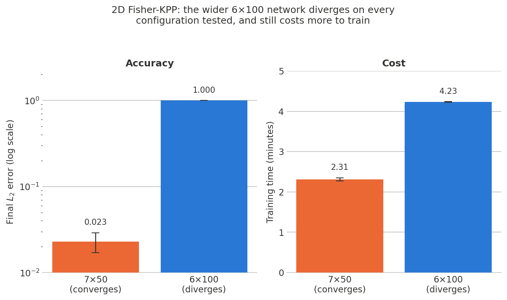
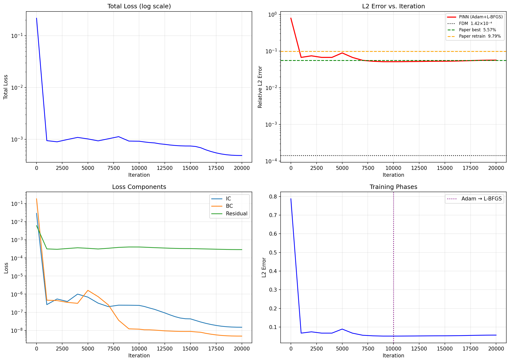
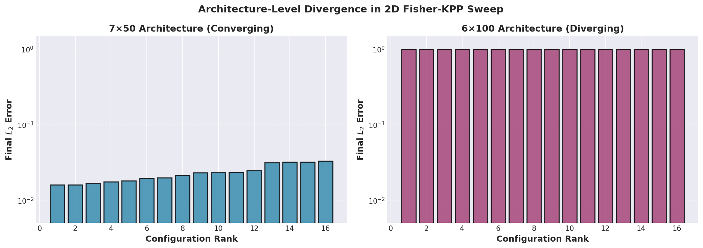

# Healing AI Amnesia in Physics-Informed Neural Networks

Retraining a Physics-Informed Neural Network (PINN) in phases — an initial fit, then one or more
fine-tuning passes — is standard practice, and it is just as standard to reinitialize the Adam optimizer
at the start of every phase. That reset is a bug: it silently discards the optimizer's accumulated
gradient-moment estimates, and each retraining pass makes the model *worse*, not better.

**The fix is simple: don't reset it.** Preserving Adam's internal state across phases (and, for a final
fine-tuning pass, switching to L-BFGS with its own state preserved) turns retraining from harmful to
helpful. On the 1D Fisher-KPP reaction-diffusion equation this cuts final relative L2 error by **47.6%**
and reverses the direction of every retraining phase.

**Full write-up: [docs/Report.pdf](docs/Report.pdf).**

## The fix, in one picture


| | Phase 1 | Phase 2 | Phase 3 (final) |
|---|---|---|---|
| Optimizer reset each phase (the bug) | 5.01e-2 | 7.69e-2 | 8.70e-2 — *worse every phase* |
| Optimizer state preserved (the fix) | 5.82e-2 | 4.55e-2 | 4.56e-2 — *better every phase* |

Resetting the optimizer isn't a neutral default — it actively degrades a PINN with every retraining
pass. Preserving its state instead reduces final error by 47.6% and makes retraining worth doing.

This was validated on the 1D Fisher-KPP equation from [Aberqi & Miloudi
(arXiv:2601.11406v1)](2601.11406v1.pdf), which documents the same reset-driven degradation and
*recommends* saving/restoring optimizer state as a possible fix (Section 5.2) — without implementing or
quantifying it. This project implements that fix and puts a real number on it.

## Does it generalize? Extending to 2D

The source paper only covers the 1D case. Extending the same PINN to 2D Fisher-KPP surfaced a second,
independent finding: architecture choice can dominate everything else. A 32-configuration sweep over
network shape and learning-rate schedule found:



A wider-but-shallower 6×100 network diverges on **every one of the 16 schedules tested** (L2 ≈ 1.0,
i.e. it collapses to a trivial solution) and is still ~83% slower to train than the narrower, deeper
7×50 network that converges reliably (L2 = 0.023 ± 0.006). This is original work — the source paper
never studies 2D — and it's an honest negative result: wider isn't better here, on any axis.

## Result plots

<table>
<tr>
<td></td>
<td></td>
</tr>
<tr>
<td align="center"><sub>Optimizer reset each phase — L2 error rises across phases</sub></td>
<td align="center"><sub>Optimizer state preserved — L2 error falls across phases</sub></td>
</tr>
</table>



## Repository layout

```
pinn.py, pinn_early.py(.ipynb)     1D experiments: pinn.py is the fixed (adaptive I-PINN) pipeline;
                                    pinn_early is the paper-faithful reset-each-phase baseline
exact_solution.py                  Analytical traveling-wave reference solution
memoryAwarePINN/                   1D "optimizer state preserved" variant + its 32-config sweep
2d_pinn/                           2D dataset generation + both 2D notebooks (with/without the fix)
fdm_solver_2d.py                   Explicit 2D finite-difference baseline
checkpoints/2d/                    Saved 2D model/optimizer checkpoints
results/1d/, results/2d/           Training-history plots, single-run results, the 2D sweep CSV + its
                                    32 per-configuration plots (results/2d/sweep/runs/)
figures_2d/, figures_comparison/   Publication-quality figures generated by generate_2d_plots.py /
                                    generate_comparison_plots.py
figures_summary/                   The two headline bar charts above, from generate_summary_figures.py
docs/                              Report.pdf (the full write-up) + report.tex source; docs/notes/ has
                                    older planning notes superseded by the report
2601.11406v1.pdf                   The source paper being validated/extended
```

## Method

Both 1D conditions use the same architecture: a fully-connected 7×50 tanh network, Xavier-normal weight
init, mapping `(x, t) → u(x, t)`, trained on the composite PINN loss (interior PDE residual + initial +
boundary conditions) with the paper's adaptive IC/BC weighting scheme. The two conditions differ only in
what happens at each phase boundary:

- **Reset** (`pinn_early.ipynb`, matches the paper): a fresh `torch.optim.Adam` every phase, discarding
  all accumulated moment estimates.
- **Preserved** (`memoryAwarePINN/modiified_pinn.ipynb`, the fix): model weights *and* optimizer state
  carry over between phases; the final phase switches to L-BFGS with its own state preserved.

The 2D extension (`2d_pinn/`) repeats this on the 2D Fisher-KPP equation, `u_t = D(u_xx + u_yy) + Ru(1-u)`,
with a 32-run architecture × schedule sweep evaluated by final relative L2 error and training time.
