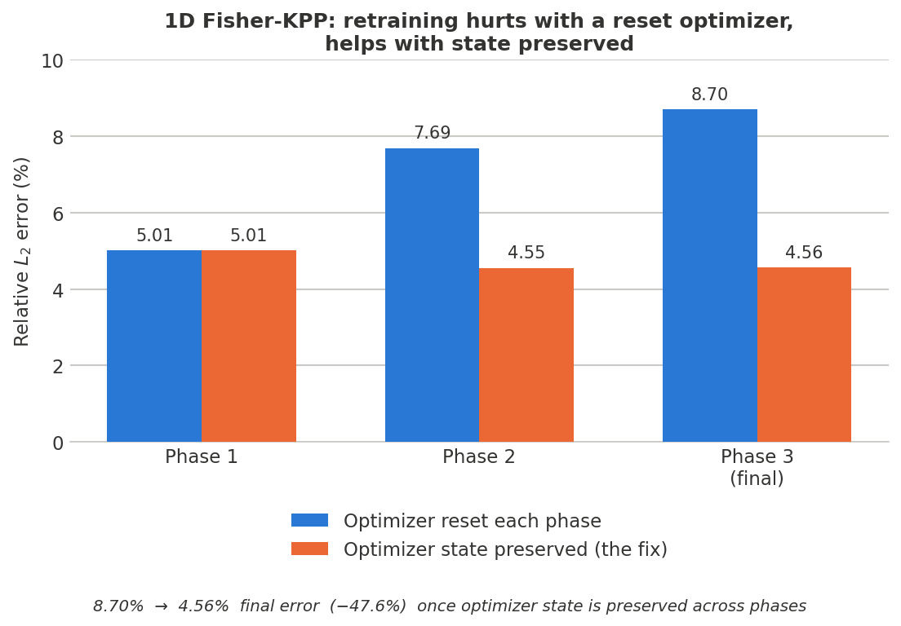
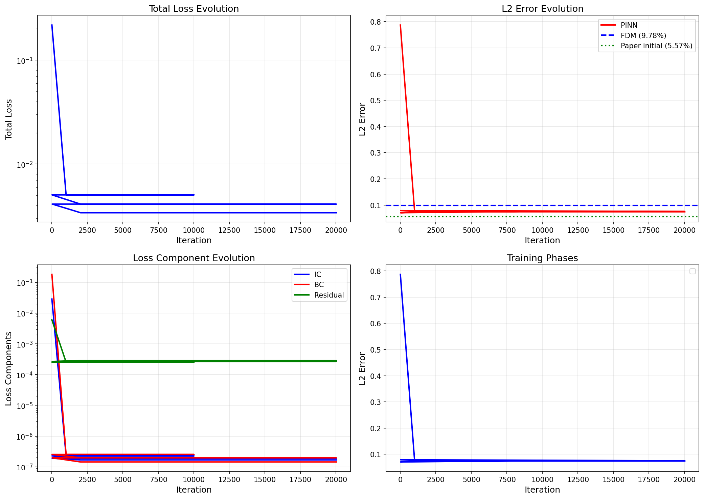

# Healing AI Amnesia in Physics-Informed Neural Networks

It is standard ppractice to retrain Physics-Informed Neural Networks (PINN) in phases: an initial fit, then one or more
fine-tuning passes. It is just as standard to reinitialize the Adam optimizer
at the start of every phase. That reset discards the optimizer's accumulated
gradient-moment estimates, and each retraining pass makes the model *worse*, not better.

I found a very simple fix: Preserving Adam's internal state across phases (and, for a final
fine-tuning pass, switching to L-BFGS with its own state preserved) turns retraining from harmful to
helpful. On the 1D Fisher-KPP reaction-diffusion equation this cuts final relative L2 error by **47.6%**
and reverses the direction of every retraining phase.

**Full write-up: [docs/Report.pdf](docs/Report.pdf).**

## The fix, in one picture



| | Phase 1 | Phase 2 | Phase 3 (final) |
|---|---|---|---|
| Optimizer reset each phase (the bug) | 5.01e-2 | 7.69e-2 | 8.70e-2 — *worse every phase* |
| Optimizer state preserved (the fix) | 5.01e-2 | 4.55e-2 | 4.56e-2 — *better every phase* |

Resetting the optimizer isn't a neutral default — it actively degrades a PINN with every retraining
pass. Preserving its state instead reduces final error by 47.6% and makes retraining worth doing.

This was validated on the 1D Fisher-KPP equation from [Aberqi & Miloudi
(arXiv:2601.11406v1)](2601.11406v1.pdf), which documents the same reset-driven degradation and
*recommends* saving/restoring optimizer state as a possible fix (Section 5.2) — without implementing or
quantifying it. This project implements that fix and puts a real number on it.

## Result plots

<p align="center">

<br>
<sub>Optimizer reset each phase — L2 error rises across phases</sub>
</p>

## Repository layout

```
pinn.py, pinn_early.py(.ipynb)     1D experiments: pinn.py is the fixed (adaptive I-PINN) pipeline;
                                    pinn_early is the paper-faithful reset-each-phase baseline
exact_solution.py                  Analytical traveling-wave reference solution
memoryAwarePINN/                   1D "optimizer state preserved" variant + its 32-config sweep
results/1d/                        Training-history plots and single-run results
figures_summary/                   The headline bar chart above, from generate_summary_figures.py
docs/                              Report.pdf (the full write-up) + report.tex source; docs/notes/ has
                                    older planning notes superseded by the report
2601.11406v1.pdf                   The source paper being validated/extended
```

## Method

Both conditions use the same architecture: a fully-connected 7×50 tanh network, Xavier-normal weight
init, mapping `(x, t) → u(x, t)`, trained on the composite PINN loss (interior PDE residual + initial +
boundary conditions) with the paper's adaptive IC/BC weighting scheme. The two conditions differ only in
what happens at each phase boundary:

- **Reset** (`pinn_early.ipynb`, matches the paper): a fresh `torch.optim.Adam` every phase, discarding
  all accumulated moment estimates.
- **Preserved** (`memoryAwarePINN/modiified_pinn.ipynb`, the fix): model weights *and* optimizer state
  carry over between phases; the final phase switches to L-BFGS with its own state preserved.
